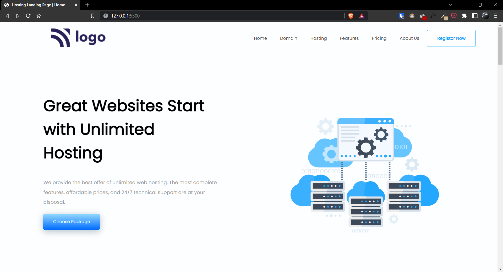
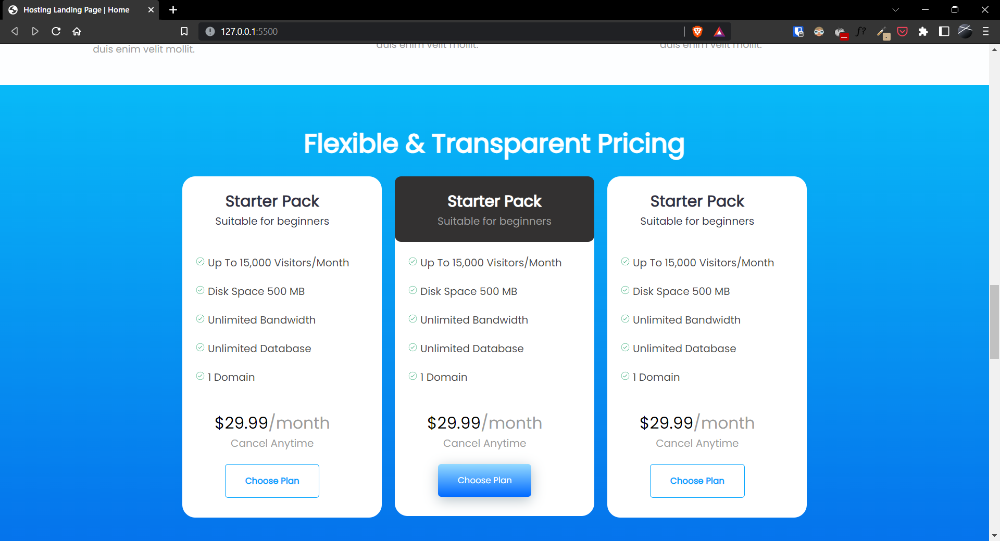
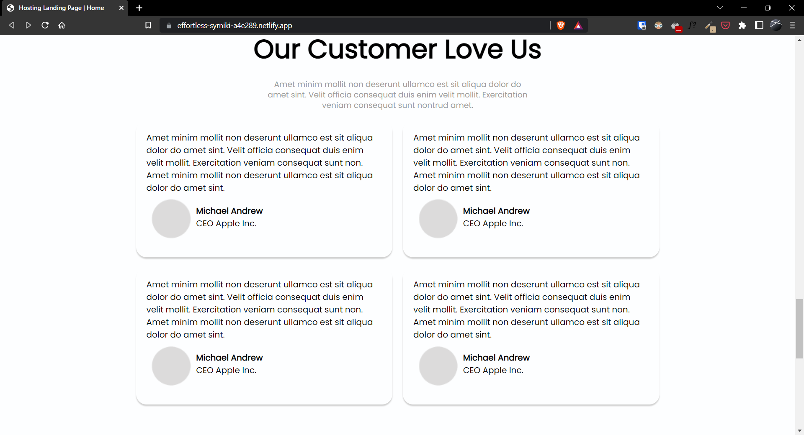
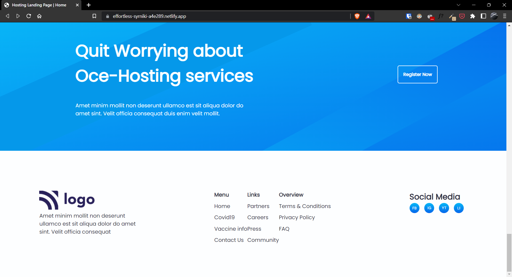

# Project-11 | Hosting Landing Page

Hi there,
I'm Wasit Ali and this is my 11th project on HTML and CSS.

## 🖥 Preview

🚀 [Live Preview](https://effortless-syrniki-a4e289.netlify.app/)

## 🛠️ What I have learned in this project?

- Learned to use css position properties.
- Learnt about cards and its positioning on different screen sizes.
- Flex wrap to various to make it more responsive.

## ⏲ Time to finish the project

- 20 hours
